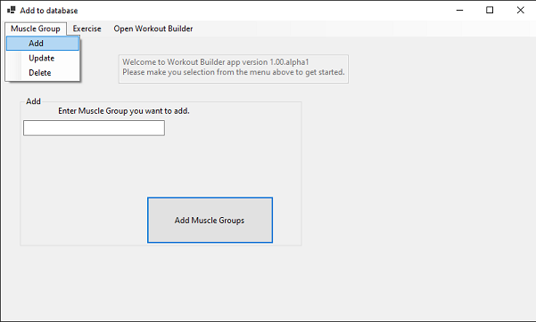
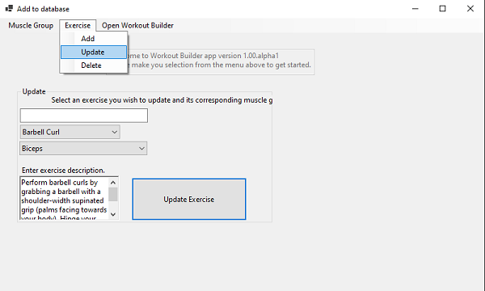

# Workout Builder App
## Getting Started
- VS 2022
- .NET 6
- Database (After cloning project, run 'Update-Database' in the Package Manager Console)

## Features
- Allows the user to input individual muscle groups and related exercises into a database.
- Enables updating and deleting of existing data.
- Adding/Updating/Deleting of Muscle Groups and Exercises can be done from a single form by selecting from the desired function from the menu strip.
- After filling the databse with desired data, the user can then build workouts with the workout builder form.

## Add/Update/Delete Form
### To add, update, or delete a muscle group or exercise, select it from the menu at the top of the app.

### Muscle Group Menu Options

### Exercise Menu Options

